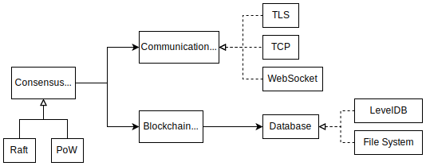
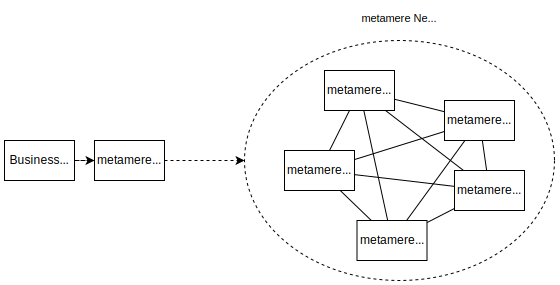

    

    
Ultra-lightweight Blockchain

## Architecture

The minimal components required for a blockchain are a core that computes and chains hash values of data, a database, a consensus algorithm, and a communication protocol implementation. The metamere abstracts these sufficiently to allow the user to choose what is best for the system. The system is designed to allow the user to select the most appropriate one for the system.

## Network

The aforementioned components are executed within a single Node.js process, which we refer to as a node. Nodes can be executed completely in parallel and always synchronize their data by working in concert with other nodes.

Generally speaking, blockchains are often referred to as smart contracts, which are processes related to data and executed within the blockchain. However, they can destabilize the blockchain itself if they are not debugged sufficiently. Moreover, debugging them requires special methods, which can lead to productivity problems.

For this reason, the metamere has decided to separate data processing from node processing. In other words, these processes are placed outside of the network composed of nodes, and are executed via the metamere Client, which implements the API.

## Setting

Settings are described in JSON format. See [examples](../examples) for samples.

<table>
    <thead>
        <tr>
            <td><b>Key</b></td><td><b>Value</b></td>
        </tr>
    </thead>
    <tbody>
        <tr>
            <td>blockVersion</td><td>Version of block data. Currently <code>1.0.</code></td>
        </tr>
        <tr>
            <td>id</td><td>Node ID</td>
        </tr>
        <tr>
            <td>host</td><td>Host name of the node</td>
        </tr>
        <tr>
            <td>port</td><td>Port number of the node</td>
        </tr>
        <tr>
            <td>protocol</td><td>Communication protocol. <code>tcp</code>, <code>tls</code>, or <code>ws</code>.</td>
        </tr>
        <tr>
            <td>consensusAlgorithm</td><td>Consensus algorithm, either <code>Raft</code> or <code>Simple</code>.</td>
        </tr>
        <tr>
            <td>storage</td><td>Database type, either <code>LevelDB</code> or <code>Simple</code>.</td>
        </tr>
        <tr>
            <td>storagePath</td><td>Required if storage is <code>Simple</code>. Path to the file to be persisted.</td>
        </tr>
        <tr>
            <td>indexKeys</td><td>Option for <code>LevelDB</code>. Set this option when indexes are applied to keys contained in data.</td>
        </tr>
        <tr>
            <td>privateKey</td><td>Required for <code>tls</code>. File path of the node's private key.</td>
        </tr>
        <tr>
            <td>certificate</td><td>Required for <code>tls</code>. File path of the node's certificate.</td>
        </tr>
        <tr>
            <td>rootCertificates</td><td>Required for <code>tls</code>. File path of the root certificate.</td>
        </tr>
        <tr>
            <td>nodes</td><td>Describe the settings of other nodes in an array; in the case of <code>Raft</code>, three or more nodes are required.</td>
        </tr>
        <tr>
            <td>&nbsp;&nbsp;&nbsp;&nbsp;id</td><td>Node ID to be connected</td>
        </tr>
        <tr>
            <td>&nbsp;&nbsp;&nbsp;&nbsp;url</td><td>The URL of the node to connect to, e.g. <code>tls://HOST:PORT</code> for TLS.</td>
        </tr>
    </tbody>
</table>

---

&copy; Takuro Okada